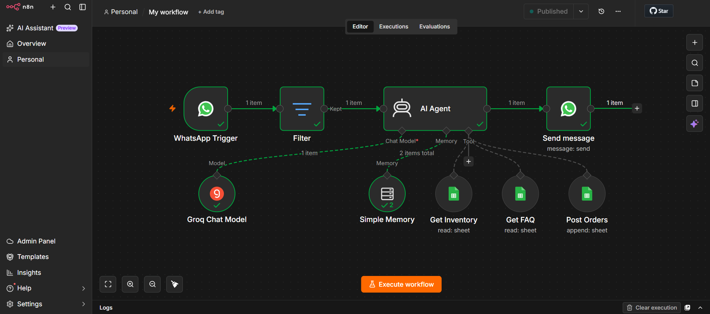
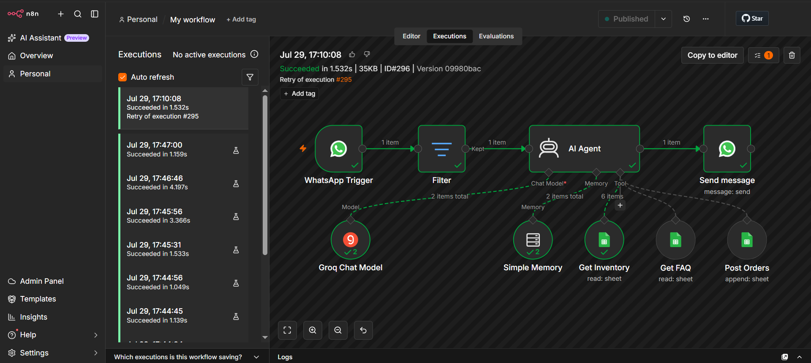
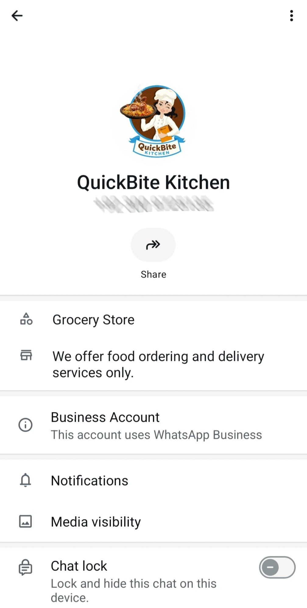
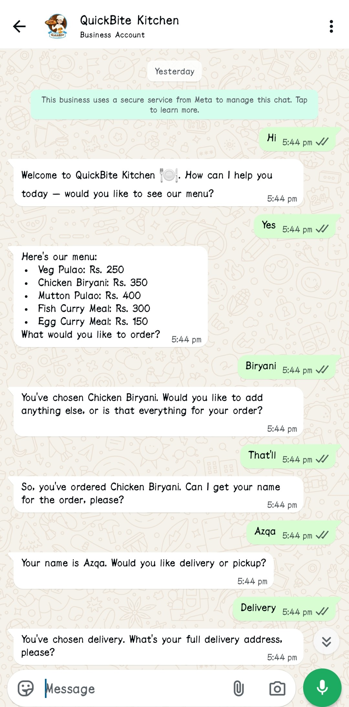
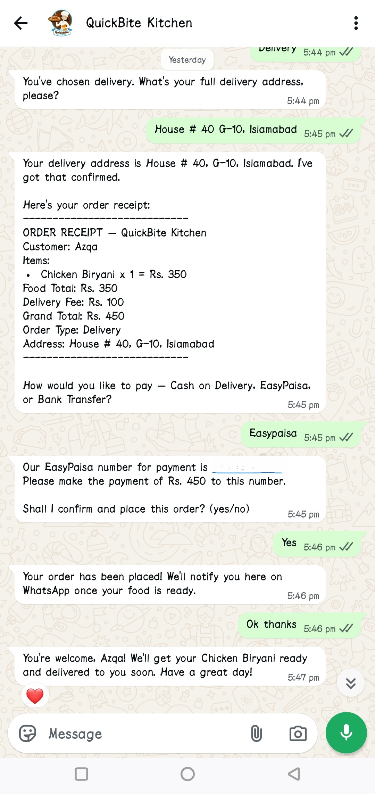
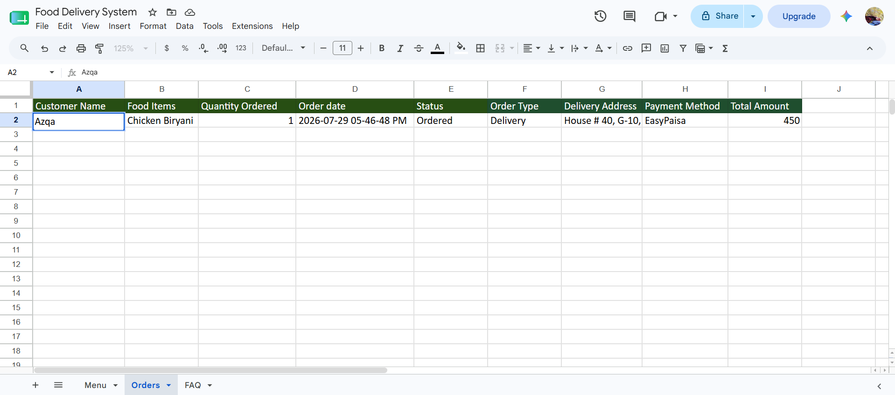

# 🍽️ WhatsApp AI Agent — QuickBite Kitchen

An AI-powered WhatsApp assistant that takes food orders, answers menu & FAQ questions, and logs everything automatically — no human on the other end! 🤖💬

Built with **n8n**, **Groq AI (LLaMA 3)**, **WhatsApp Business Cloud API**, and **Google Sheets**.

---

## ✨ What It Does

Customers simply message the business on WhatsApp like they would with a friend, and the AI Agent handles the rest:

- 🍛 Shares the live menu from Google Sheets
- ❓ Answers frequently asked questions
- 🛒 Takes the full order conversationally (item → address → payment method)
- 🧾 Generates an order receipt right inside the chat
- 📊 Logs every confirmed order into Google Sheets automatically
- 🧠 Remembers the conversation using memory, so it never loses context mid-order

All of this happens 24/7, without anyone manually replying.

---

## 🛠️ Tech Stack

| Tool | Role |
|------|------|
| **n8n Cloud** | Core workflow automation engine |
| **Groq AI (LLaMA 3)** | Understands customer messages & generates replies |
| **WhatsApp Business Cloud API** | Sends & receives customer messages |
| **Google Sheets** | Stores Inventory, FAQ, and Orders data |
| **Simple Memory (n8n)** | Keeps track of the conversation history |

---

## 🔄 How It Works

```
WhatsApp Message → Filter → AI Agent (Groq LLaMA) → Send WhatsApp Reply
                                │
        ┌────────────┬──────────┼──────────┬────────────┐
       Simple Memory  Get Inventory  Get FAQ  Post Orders
```

The AI Agent decides on its own which tool to use — checking inventory, answering a FAQ, or saving a new order — based on what the customer is asking.

---

## 📸 Screenshots

**n8n Workflow — Architecture**


**Successful Execution Flow**


**WhatsApp Business Profile**


**Real Conversation — Ordering in Action**



**Order Auto-Logged in Google Sheets**


---

## ⚡ Challenges Faced

Building this wasn't just "connect a few nodes and done" — real issues came up along the way:

- **Groq API rate limiting** during repeated testing → fixed by spacing out requests
- **WhatsApp access token expiry** (temporary tokens expire in 24h) → resolved by generating a fresh token via Meta's Graph API Explorer with the correct permissions

Documenting and debugging these gave real hands-on experience with running an AI workflow outside a tutorial bubble.

---

## 🚀 Future Improvements

- [ ] Switch to a permanent WhatsApp System User token
- [ ] Move from Google Sheets to a proper database for scalability
- [ ] Add payment gateway integration
- [ ] Order status tracking & delivery updates

---

## 📁 Project Files

- `My workflow.json` — the exportable n8n workflow (import this into your own n8n instance to run it)
- `Screenshots/` — all proof-of-work screenshots above

---

## 👩‍💻 Author

**Azqa Naseeb**
Built as a hands-on project exploring AI + automation for real business use cases.

⭐ If you found this interesting, feel free to star the repo!
